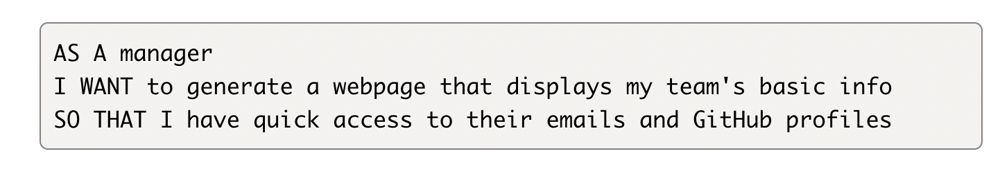
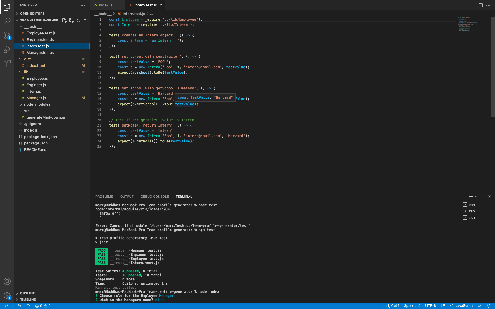
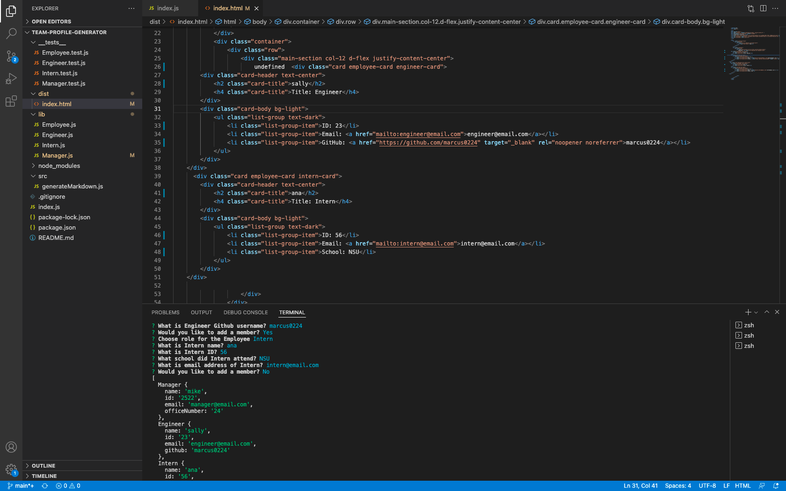
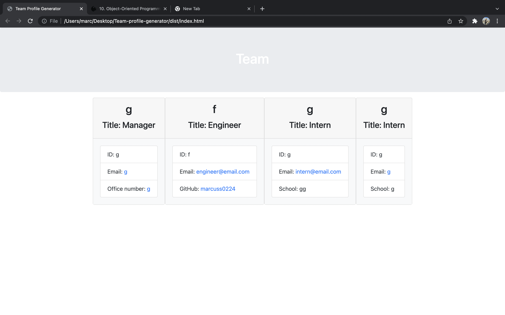

# Team-profile-generator

## Github
https://github.com/Marcus0224/Team-profile-generator

# Walkthrough Video:
https://drive.google.com/file/d/1gpa1KNKNUwaSraQMaiVBd6SaieWcOG-p/view

## User Story 

## Description
Enter (Node index) into command-line application that will take in information about employees on a software engineering team and generates an HTML webpage that displays summaries for each person.

## Screenshots

## Technology Used
NPM, Node.js, Jest, Inquirer & Bootstrap 
